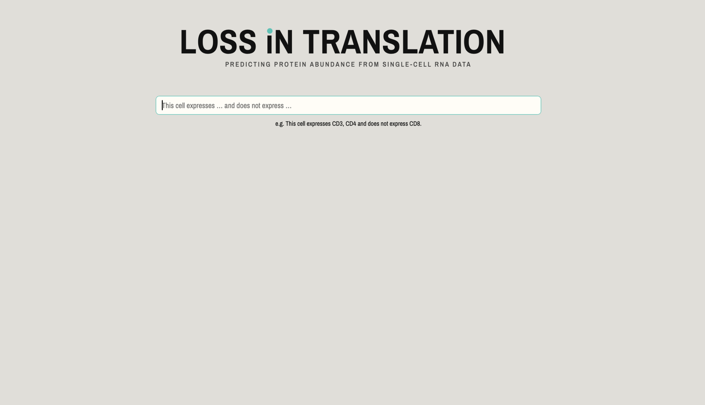

# CITE-seq CLIP Explorer

Interactive Streamlit app for exploring a CLIP-style model that aligns
single-cell RNA embeddings with natural-language queries. Built for the
Lemanic Life Sciences Hackathon 2026.

## What the app does

Type a free-text description of a cell population — e.g.
*"This cell expresses CD3, CD4 and does not express CD8."* — and the app
shows which cells in the dataset match:

- **UMAP** — every cell in 2D, colored by similarity, cell type, or disease status
- **Heatmap** — mean similarity across cell types
- **Violin** — full distribution of similarity per cell type
- **Bar plots** — disease-status composition and per-patient breakdown of the matched cohort
- **Summary** — a plain-language description of the cohort, streamed from a local LLM (optional)



## Setup

```bash
git clone <this repo>
cd <repo>
python -m venv .venv && source .venv/bin/activate
pip install -r requirements.txt
```

### Required artifacts

These files are **not** in the repo. Drop them into the project locally:

| File | Location | Description |
| --- | --- | --- |
| `clip_model.pth` | `weights/` | Trained CLIP model state dict |
| `rna_embeddings.h5` | `data/` | Precomputed RNA feature embeddings, HDF5 with an `embeddings` dataset of shape `(n_cells, 1626)` |
| `*.h5mu` | `data/` (optional) | MuData file with `rna.obs['CellType']`, `Status`, `Subject` columns. Enables heatmap, violin, and bar plots. |

The RNA feature dim, query dim, and projection dim are set in
`citeseq_explorer/config.py` (`D_RNA`, `D_QUERY`, `D_EMB`). Update them to
match your trained model.

### Optional: local LLM summaries

The summary panel uses [Ollama](https://ollama.com) running locally:

```bash
ollama pull llama3.2
ollama serve
```

The model name is configurable at the top of `citeseq_explorer/summary.py`.

## Run

```bash
streamlit run streamlit_app.py
```

The first launch computes UMAP coordinates and caches them under `cache/`.
Subsequent launches load from cache.

## Project layout

```
.
├── streamlit_app.py              # entry point
├── citeseq_explorer/
│   ├── config.py                 # paths, dims, constants
│   ├── data.py                   # load RNA embeddings + .h5mu
│   ├── model.py                  # CLIP projection heads
│   ├── embeddings.py             # RNA projection, text query encoding, UMAP
│   ├── cohort_panel.py           # disease-status + per-patient bar plots
│   ├── summary.py                # LLM cohort summary
│   └── viz/
│       ├── base.py               # shared types + cohort mask
│       ├── umap_viz.py
│       ├── heatmap_viz.py
│       └── violin_viz.py
├── requirements.txt
└── README.md
```
